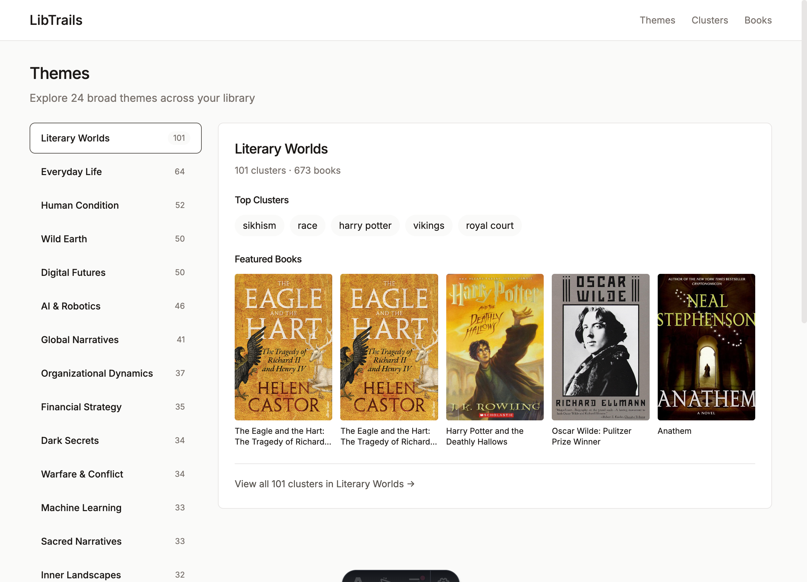
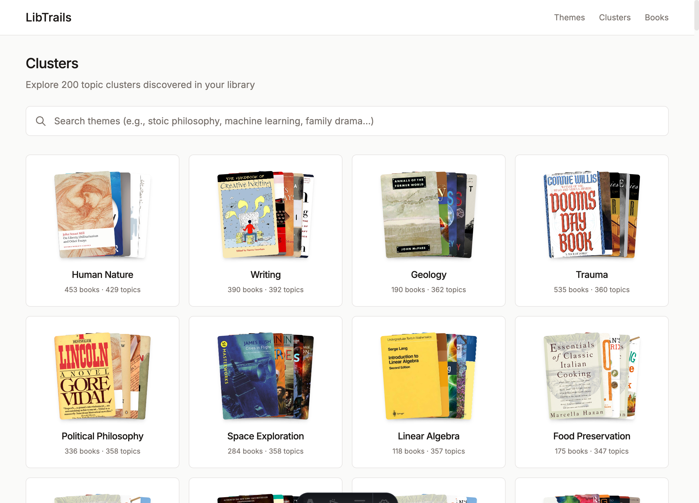

# libtrails

Trail-finding across your book library using semantic search and topic clustering.

Inspired by [Pieter Maes' "Reading Across Books" project](https://pieterma.es/syntopic-reading-claude/) and the [Trails visualization](https://trails.pieterma.es).

## What is this?

libtrails helps you discover conceptual connections across your book collection. It extracts topics from your EPUBs using a local LLM, generates semantic embeddings, and builds a hierarchical topic graph—all stored locally in SQLite.

**Use cases:**
- Find books that discuss similar themes
- Discover unexpected connections between books
- Build "trails" of related excerpts across your library
- Explore your reading interests through topic clusters

## Screenshots

### Themes Browser
Browse 24 broad themes (super-clusters) with a two-panel interface. Click a theme to see its top clusters and featured books.



### Clusters Grid
Explore 845 topic clusters with semantic search. Each card shows stacked book covers with a fan-out effect on hover.



## How it works

```
EPUB → Chunks (500 words) → Topic Extraction (Ollama) → Normalize → Embed → Deduplicate → Cluster
                                                                      ↓
                                                               sqlite-vec
                                                                      ↓
                                                            Semantic Search
```

1. **Parse**: Extract text from EPUB files
2. **Chunk**: Split into ~500 word segments
3. **Extract**: Use local LLM to identify 5 topics per chunk
4. **Embed**: Generate semantic embeddings with BGE-small-en-v1.5
5. **Deduplicate**: Merge similar topics (cosine similarity > 0.85)
6. **Cluster**: Group related topics using Leiden algorithm
7. **Super-cluster**: K-means on cluster centroids creates 24 broad themes
8. **Search**: Query topics semantically with sqlite-vec

## Features

- **100% Local**: All processing happens on your machine (Ollama + local embeddings)
- **Calibre Integration**: Reads metadata from your Calibre library
- **Semantic Search**: Find topics by meaning, not just keywords
- **Topic Clustering**: Automatic hierarchical organization with Leiden algorithm
- **Super-clusters**: 24 broad themes generated via LLM labeling
- **Web Interface**: Modern Astro + FastAPI frontend for browsing
- **Co-occurrence Analysis**: Discover topics that appear together
- **SQLite Storage**: Everything in one portable database file

## Installation

Requires Python 3.11+ and [uv](https://github.com/astral-sh/uv) for package management.

```bash
# Clone the repository
git clone https://github.com/seaberger/libtrails.git
cd libtrails

# Create virtual environment and install
uv venv
uv pip install -r requirements.txt
uv pip install -e .

# Install Ollama for topic extraction
# See: https://ollama.ai
ollama pull gemma3:4b
```

### Configuration

Edit `src/libtrails/config.py` to set your Calibre library path:

```python
CALIBRE_LIBRARY_PATH = Path.home() / "Calibre Library"  # Adjust to your path
```

## Quick Start

### CLI Usage

```bash
# Check status
uv run libtrails status

# Index a book (parse, chunk, extract topics)
uv run libtrails index --title "Siddhartha"

# Run the post-processing pipeline
uv run libtrails process

# Semantic search
uv run libtrails search-semantic "spiritual journey"

# Browse topic clusters
uv run libtrails tree
```

### Web Interface

```bash
# Terminal 1: Start API server
uv run libtrails serve

# Terminal 2: Start frontend (requires Node.js)
cd web && npm install && npm run dev

# Open http://localhost:4321
```

**Navigation:**
- **Themes** (`/themes`): Browse 24 broad themes with two-panel domain browser
- **Clusters** (`/clusters`): Explore 845 topic clusters with semantic search
- **Books** (`/books`): Browse all indexed books

## CLI Reference

### Indexing

| Command | Description |
|---------|-------------|
| `libtrails status` | Show library stats and indexing progress |
| `libtrails index <id>` | Index a book by database ID |
| `libtrails index --title "Name"` | Index a book by title |
| `libtrails index --all` | Index all books |
| `libtrails index --dry-run` | Parse and chunk without topic extraction |
| `libtrails topics <id>` | Show extracted topics for a book |
| `libtrails models` | List available Ollama models |

### Post-Processing

| Command | Description |
|---------|-------------|
| `libtrails process` | Run full pipeline (embed → dedupe → cluster) |
| `libtrails embed` | Generate embeddings for all topics |
| `libtrails embed --force` | Regenerate all embeddings |
| `libtrails dedupe` | Deduplicate similar topics |
| `libtrails dedupe --dry-run` | Preview without making changes |
| `libtrails cluster` | Cluster topics using Leiden algorithm |
| `libtrails load-domains` | Load super-cluster domain labels |

### Discovery

| Command | Description |
|---------|-------------|
| `libtrails search-semantic <query>` | Semantic search for topics and books |
| `libtrails search <query>` | Text search in topics |
| `libtrails tree` | Browse full topic hierarchy |
| `libtrails tree <topic>` | Search for specific topics |
| `libtrails related <topic>` | Find related topics via graph |
| `libtrails cooccur <topic>` | Topics that co-occur in chunks |
| `libtrails book-clusters <id>` | Show clusters a book belongs to |

### Server

| Command | Description |
|---------|-------------|
| `libtrails serve` | Start FastAPI server (default: localhost:8000) |
| `libtrails serve --reload` | Start with auto-reload for development |

## API Endpoints

| Endpoint | Description |
|----------|-------------|
| `GET /api/v1/domains` | List 24 broad themes with cluster counts |
| `GET /api/v1/domains/{id}` | Domain detail with all clusters |
| `GET /api/v1/themes` | List topic clusters (Leiden) |
| `GET /api/v1/themes/search?q=...` | Semantic search for clusters |
| `GET /api/v1/themes/{id}` | Cluster detail with books |
| `GET /api/v1/books` | List all indexed books |
| `GET /api/v1/books/{id}` | Book detail with topics |
| `GET /api/v1/books/{id}/related` | Find related books |
| `GET /api/v1/search?q=...` | Search books and topics |
| `GET /api/v1/covers/{calibre_id}` | Book cover image |

## Example Output

```
$ uv run libtrails search-semantic "spiritual journey"

                     Matching Topics
┏━━━━━━━━━━━━━━━━━━━━━━━━━━━━┳━━━━━━━━━━━━┳━━━━━━━━━━━━━┓
┃ Topic                      ┃ Similarity ┃ Occurrences ┃
┡━━━━━━━━━━━━━━━━━━━━━━━━━━━━╇━━━━━━━━━━━━╇━━━━━━━━━━━━━┩
│ spirituality               │ 0.803      │ 4           │
│ spiritual awakening        │ 0.792      │ 14          │
│ river journey              │ 0.774      │ 2           │
│ spiritual practices        │ 0.768      │ 2           │
│ pilgrimage                 │ 0.765      │ 5           │
└────────────────────────────┴────────────┴─────────────┘

Books with matching topics:
┏━━━━━━━━━━━━┳━━━━━━━━━━━━━━━━┳━━━━━━━━━━━┓
┃ Title      ┃ Author         ┃ Relevance ┃
┡━━━━━━━━━━━━╇━━━━━━━━━━━━━━━━╇━━━━━━━━━━━┩
│ Siddhartha │ Hermann Hesse  │ 0.803     │
└────────────┴────────────────┴───────────┘
```

## Architecture

### Database Schema

```sql
books              -- Book metadata (matched to Calibre)
chunks             -- Text chunks (~500 words each)
chunk_topics       -- Raw extracted topics per chunk
topics             -- Normalized topics with embeddings
chunk_topic_links  -- Many-to-many: chunks ↔ topics
topic_cooccurrences -- Co-occurrence counts with PMI scores
topic_vectors      -- sqlite-vec virtual table for vector search
domains            -- Super-cluster labels (24 broad themes)
cluster_domains    -- Mapping: Leiden cluster → domain
```

### Key Dependencies

| Package | Purpose |
|---------|---------|
| `selectolax` | Fast EPUB/HTML parsing |
| `sentence-transformers` | BGE embeddings |
| `sqlite-vec` | Vector similarity search |
| `python-igraph` | Graph construction |
| `leidenalg` | Community detection |
| `click` + `rich` | CLI interface |
| `fastapi` + `uvicorn` | API server |
| `astro` | Frontend framework |

### Embedding Model

Uses [BGE-small-en-v1.5](https://huggingface.co/BAAI/bge-small-en-v1.5):
- 384 dimensions
- Optimized for semantic textual similarity
- Cached locally in `models/` directory (first run downloads ~130MB)
- Cosine similarity for distance metric

## Current Stats

| Metric | Value |
|--------|-------|
| Indexed books | 925 |
| Topics | 108,668 |
| Leiden clusters | 845 |
| Super-clusters (domains) | 24 |

## Roadmap

### Completed
- [x] EPUB parsing and chunking
- [x] Topic extraction via Ollama
- [x] Semantic embeddings with BGE
- [x] Topic deduplication
- [x] Leiden clustering with hub removal
- [x] Super-cluster generation (K-means on centroids)
- [x] LLM-generated domain labels
- [x] Web interface (Astro + FastAPI)
- [x] Two-panel theme browser
- [x] Semantic search in UI

### In Progress
- [ ] Galaxy/Universe visualization (UMAP projection)
- [ ] Domain filtering on clusters page

### Future
- [ ] Cross-book trail generation
- [ ] Book recommendations based on topic overlap
- [ ] Deploy to cloud (AWS Lightsail)
- [ ] Calibre plugin integration

## Contributing

Contributions welcome! Please open an issue to discuss major changes.

## Acknowledgments

- [Pieter Maes](https://pieterma.es) for the original inspiration and approach
- [sqlite-vec](https://github.com/asg017/sqlite-vec) for embedded vector search
- [BGE embeddings](https://huggingface.co/BAAI/bge-small-en-v1.5) from BAAI

## License

MIT
