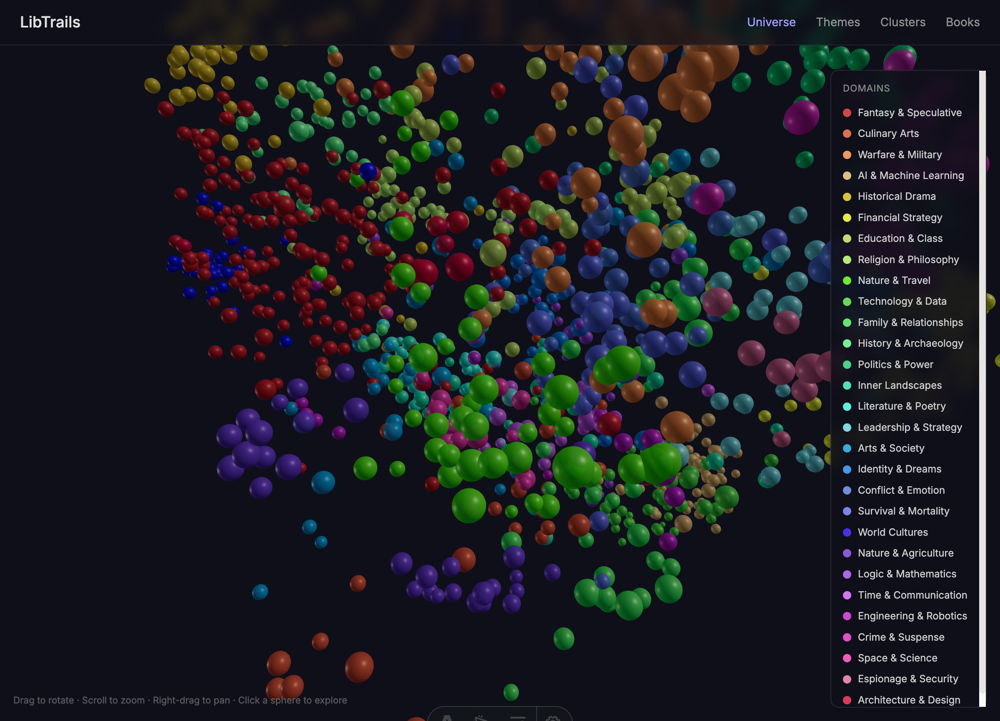
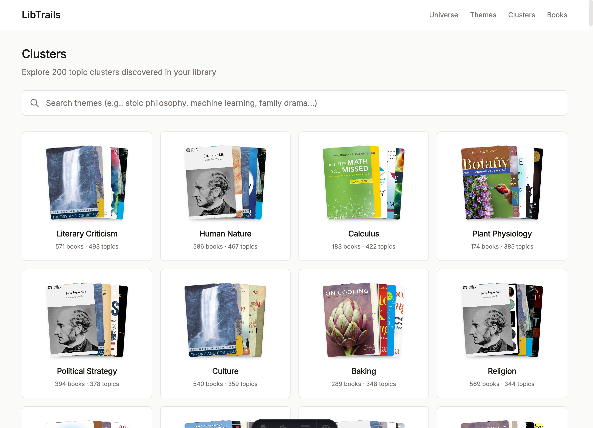
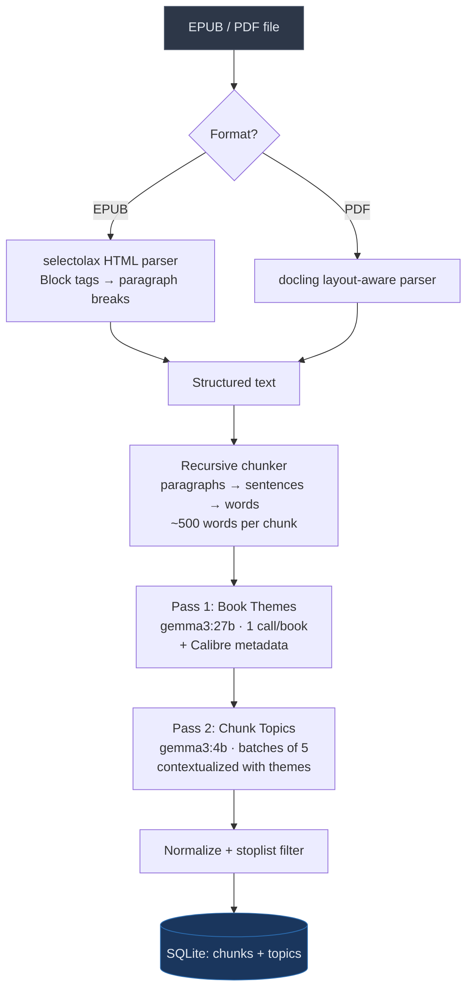
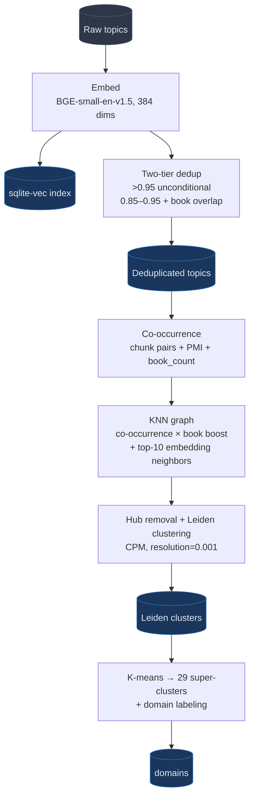
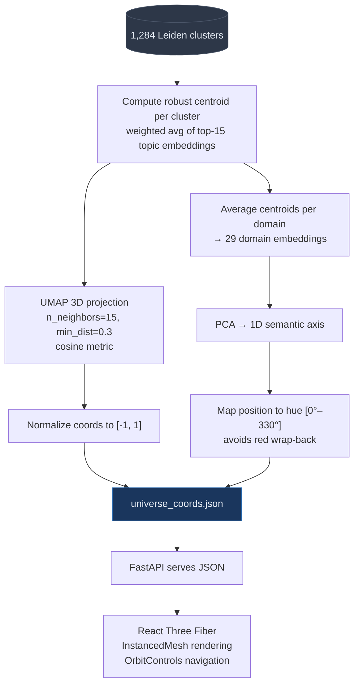
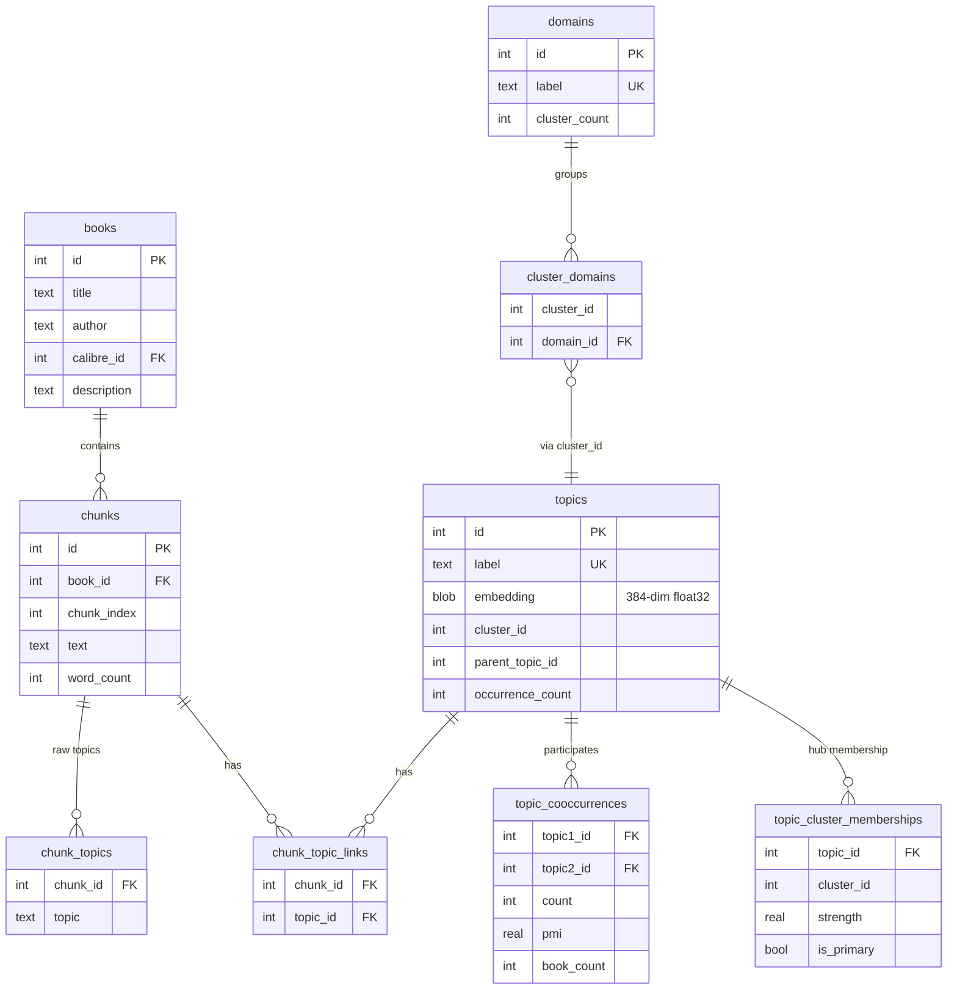

# libtrails

Trail-finding across your book library using semantic search and topic clustering.

Inspired by [Pieter Maes' "Reading Across Books" project](https://pieterma.es/syntopic-reading-claude/) and the [Trails visualization](https://trails.pieterma.es).

## What is this?

libtrails helps you discover conceptual connections across your book collection. It extracts topics from your EPUBs using a local LLM, generates semantic embeddings, and builds a hierarchical topic graph — all stored locally in SQLite.

**Use cases:**
- Find books that discuss similar themes
- Discover unexpected connections between books
- Build "trails" of related excerpts across your library
- Explore your reading interests through topic clusters

## Screenshots

### Galaxy Universe
Interactive 3D visualization of your entire library. Each sphere is a topic cluster — sized by book count, colored by domain. Semantically similar domains share similar hues. Rotate, zoom, and click to explore.



### Clusters Grid
Explore topic clusters with semantic search. Each card shows stacked book covers with topic and book counts.



### Themes Browser
Browse 29 broad themes (super-clusters) with a two-panel interface. Click a theme to see its top clusters and featured books.


---

## Architecture Overview

```mermaid
graph LR
    subgraph Sources
        EPUB[EPUB files]
        PDF[PDF files]
        CAL[(Calibre metadata.db)]
    end

    subgraph "Topic Extraction Pipeline"
        PARSE[Parse & Extract Text]
        CHUNK[Recursive Chunker<br/>paragraphs → sentences → words]
        THEMES[Pass 1: Book Themes<br/>gemma3:27b · 1 call/book]
        TOPICS[Pass 2: Chunk Topics<br/>gemma3:4b · batches of 5]
    end

    subgraph "Graph & Clustering Pipeline"
        EMB[Embed Topics<br/>BGE-small-en-v1.5]
        DEDUP[Two-Tier Dedup<br/>>0.95 unconditional<br/>0.85–0.95 + book overlap]
        GRAPH[KNN Graph<br/>co-occurrence × book boost<br/>+ embedding neighbors]
        CLUSTER[Leiden Clustering<br/>CPM partition]
        DOMAIN[Super-Clusters<br/>K-means on centroids]
        LABEL[Domain Labeling<br/>LLM + human refinement]
    end

    subgraph "Visualization Pipeline"
        UMAP[UMAP 3D Projection<br/>cosine metric]
        PCA[Semantic Colors<br/>PCA → hue mapping]
        JSON[universe_coords.json]
    end

    subgraph "Web Interface"
        API[FastAPI :8000]
        WEB[Astro + React :4321]
        THREE[Three.js Galaxy]
    end

    EPUB --> PARSE
    PDF --> PARSE
    CAL --> THEMES
    PARSE --> CHUNK --> THEMES --> TOPICS

    TOPICS --> EMB --> DEDUP --> GRAPH --> CLUSTER --> DOMAIN --> LABEL

    CLUSTER --> UMAP --> JSON
    LABEL --> PCA --> JSON

    JSON --> API --> WEB --> THREE
```



---

## Pipelines in Detail

### 1. Topic Extraction Pipeline

Converts raw books into chunked text with extracted topics using a two-pass LLM strategy. See [full documentation](docs/topic-extraction-pipeline.md).



**Key features:**
- **Two-pass extraction**: 27b model extracts book-level themes, 4b model extracts chunk topics contextualized with those themes
- **Paragraph-preserving parser**: Block-level HTML tags converted to `\n\n` paragraph breaks
- **Recursive chunker**: Splits at paragraphs first, sentences second, words as last resort
- **Metadata enrichment**: Calibre tags (cleaned), descriptions (HTML-stripped), and series info feed into theme extraction
- **Structured output**: Ollama `format` parameter with JSON schemas guarantees valid JSON

**CLI:**
```bash
uv run libtrails index --title "Siddhartha"   # Single book
uv run libtrails index --all                   # All 927 books
uv run libtrails index --dry-run              # Parse/chunk only, skip LLM
uv run libtrails index --legacy               # Old single-call extraction
```

### 2. Graph & Clustering Pipeline

Transforms raw topics into a clustered, searchable topic graph. See [full documentation](docs/graph-clustering-pipeline.md).



**Key features:**
- **Two-tier deduplication**: High-confidence merges (>0.95) are unconditional; lower-confidence (0.85–0.95) require shared books to prevent cross-domain conflation
- **Co-book edge weighting**: Topic pairs sharing multiple books get boosted graph weights via `PMI × (1 + log(1 + book_count))`
- **KNN similarity floor**: Embedding edges require cosine similarity ≥ 0.65 to prevent connecting unrelated topics
- **PMI threshold**: Only genuinely surprising co-occurrences (PMI ≥ 1.0) create graph edges

**CLI:**
```bash
uv run libtrails process                       # Full pipeline: embed → dedupe → cluster
uv run libtrails embed [--force]               # Generate/regenerate embeddings
uv run libtrails dedupe [--dry-run]            # Merge similar topics
uv run libtrails cluster                       # Run Leiden clustering
uv run libtrails regenerate-domains            # Generate super-clusters
uv run libtrails load-domains                  # Load refined domain labels
```

### 3. Visualization Pipeline

Projects clusters into 3D space and assigns semantically meaningful colors.



**Semantic colors** ensure that similar domains get similar hues. For example, "Nature & Agriculture" and "Nature & Travel" both appear as green, while "History & Archaeology" is red. This is achieved by projecting domain centroid embeddings onto a single PCA axis, then mapping each domain's position to a hue value.

**CLI:**
```bash
uv run libtrails generate-universe             # Generate 3D coordinates + colors
```

---

## Features

- **Two-Pass Topic Extraction**: Book-level themes (gemma3:27b) contextualize chunk-level topics (gemma3:4b) for domain-specific results
- **3D Galaxy Visualization**: Interactive Three.js universe with semantic domain colors (PCA on embeddings → hue mapping)
- **100% Local**: All processing on your machine (Ollama + local embeddings)
- **Calibre Integration**: Reads metadata (tags, descriptions, series) to enrich extraction
- **Semantic Search**: Find topics by meaning, not just keywords (sqlite-vec cosine)
- **Two-Tier Deduplication**: High-confidence merges unconditionally; lower-confidence merges require shared books to prevent cross-domain conflation
- **Co-Book Edge Weighting**: Topic pairs sharing multiple books get stronger graph connections
- **Topic Clustering**: Leiden algorithm with hub removal for clean communities
- **29 Domains**: Super-clusters with LLM-generated + human-refined labels
- **Web Interface**: Astro + React Three Fiber + FastAPI
- **SQLite Storage**: Everything in one portable database file

---

## Installation

Requires Python 3.11+ and [uv](https://github.com/astral-sh/uv) for package management.

```bash
# Clone the repository
git clone https://github.com/seaberger/libtrails.git
cd libtrails

# Create virtual environment and install
uv venv
uv pip install -r requirements.txt
uv pip install -e .

# Install Ollama for topic extraction
# See: https://ollama.ai
ollama pull gemma3:27b
```

### Configuration

Edit `src/libtrails/config.py` to set your Calibre library path:

```python
CALIBRE_LIBRARY_PATH = Path.home() / "Calibre Library"  # Adjust to your path
```

## Quick Start

### CLI Usage

```bash
# Check status
uv run libtrails status

# Index a book (parse, chunk, extract topics)
uv run libtrails index --title "Siddhartha"

# Run the post-processing pipeline
uv run libtrails process

# Semantic search
uv run libtrails search-semantic "spiritual journey"

# Browse topic clusters
uv run libtrails tree
```

### Web Interface

```bash
# Terminal 1: Start API server
uv run libtrails serve

# Terminal 2: Start frontend (requires Node.js)
cd web && npm install && npm run dev

# Open http://localhost:4321
```

**Navigation:**
- **Universe** (`/`): 3D galaxy visualization of all clusters
- **Themes** (`/themes`): Browse 29 domains with two-panel browser
- **Clusters** (`/clusters`): Explore topic clusters with semantic search
- **Books** (`/books`): Browse all indexed books

---

## CLI Reference

### Indexing

| Command | Description |
|---------|-------------|
| `libtrails status` | Show library stats and indexing progress |
| `libtrails index <id>` | Index a book by database ID |
| `libtrails index --title "Name"` | Index a book by title |
| `libtrails index --all` | Index all books |
| `libtrails index --dry-run` | Parse and chunk without topic extraction |
| `libtrails topics <id>` | Show extracted topics for a book |
| `libtrails models` | List available Ollama models |

### Post-Processing

| Command | Description |
|---------|-------------|
| `libtrails process` | Run full pipeline (embed → dedupe → cluster) |
| `libtrails embed` | Generate embeddings for all topics |
| `libtrails embed --force` | Regenerate all embeddings |
| `libtrails dedupe` | Deduplicate similar topics |
| `libtrails dedupe --dry-run` | Preview without making changes |
| `libtrails cluster` | Cluster topics using Leiden algorithm |
| `libtrails regenerate-domains` | Generate super-clusters from cluster centroids |
| `libtrails load-domains` | Load refined domain labels into database |

### Discovery

| Command | Description |
|---------|-------------|
| `libtrails search-semantic <query>` | Semantic search for topics and books |
| `libtrails search <query>` | Text search in topics |
| `libtrails tree` | Browse full topic hierarchy |
| `libtrails tree <topic>` | Search for specific topics |
| `libtrails related <topic>` | Find related topics via graph |
| `libtrails cooccur <topic>` | Topics that co-occur in chunks |
| `libtrails book-clusters <id>` | Show clusters a book belongs to |

### Visualization & Server

| Command | Description |
|---------|-------------|
| `libtrails generate-universe` | Generate 3D UMAP coordinates + semantic colors |
| `libtrails serve` | Start FastAPI server (default: localhost:8000) |
| `libtrails serve --reload` | Start with auto-reload for development |

---

## API Endpoints

| Endpoint | Description |
|----------|-------------|
| `GET /api/v1/universe` | 3D galaxy data (clusters with UMAP coordinates) |
| `GET /api/v1/domains` | List broad themes with cluster counts |
| `GET /api/v1/domains/{id}` | Domain detail with all clusters |
| `GET /api/v1/themes` | List topic clusters (Leiden) |
| `GET /api/v1/themes/search?q=...` | Semantic search for clusters |
| `GET /api/v1/themes/{id}` | Cluster detail with books |
| `GET /api/v1/books` | List all indexed books |
| `GET /api/v1/books/{id}` | Book detail with topics |
| `GET /api/v1/books/{id}/related` | Find related books |
| `GET /api/v1/search?q=...` | Search books and topics |
| `GET /api/v1/search/semantic?q=...` | Semantic search for books/topics |
| `GET /api/v1/covers/{calibre_id}` | Book cover image |
| `GET /api/v1/covers/book/{book_id}` | Book cover by internal ID |

---

## Database Schema



The `topic_vectors` virtual table (sqlite-vec) mirrors `topics.embedding` for fast cosine search:
```sql
CREATE VIRTUAL TABLE topic_vectors USING vec0(
    topic_id INTEGER PRIMARY KEY,
    embedding FLOAT[384] distance_metric=cosine
);
```

---

## Key Dependencies

| Package | Purpose |
|---------|---------|
| `selectolax` | Fast EPUB/HTML parsing |
| `docling` | Layout-aware PDF extraction |
| `sentence-transformers` | BGE-small-en-v1.5 embeddings (384 dims) |
| `sqlite-vec` | Vector similarity search in SQLite |
| `python-igraph` | Graph construction |
| `leidenalg` | Leiden community detection |
| `scikit-learn` | K-means (domains), PCA (semantic colors) |
| `umap-learn` | 3D dimensionality reduction |
| `click` + `rich` | CLI interface |
| `fastapi` + `uvicorn` | REST API server |
| `astro` | Frontend framework (SSG) |
| `@react-three/fiber` + `drei` | 3D galaxy visualization |

---

## Current Stats

| Metric | Value |
|--------|-------|
| Indexed books | 927 |
| Text chunks | 301,661 |
| Normalized topics | 153,040 |
| Leiden clusters | 1,284 |
| Domains (super-clusters) | 29 |
| Embedding model | BGE-small-en-v1.5 (384 dims) |
| Clustering | Leiden CPM, resolution=0.001 |

---

## Example Output

```
$ uv run libtrails search-semantic "spiritual journey"

                     Matching Topics
┏━━━━━━━━━━━━━━━━━━━━━━━━━━━━┳━━━━━━━━━━━━┳━━━━━━━━━━━━━┓
┃ Topic                      ┃ Similarity ┃ Occurrences ┃
┡━━━━━━━━━━━━━━━━━━━━━━━━━━━━╇━━━━━━━━━━━━╇━━━━━━━━━━━━━┩
│ spirituality               │ 0.803      │ 4           │
│ spiritual awakening        │ 0.792      │ 14          │
│ river journey              │ 0.774      │ 2           │
│ spiritual practices        │ 0.768      │ 2           │
│ pilgrimage                 │ 0.765      │ 5           │
└────────────────────────────┴────────────┴─────────────┘

Books with matching topics:
┏━━━━━━━━━━━━┳━━━━━━━━━━━━━━━━┳━━━━━━━━━━━┓
┃ Title      ┃ Author         ┃ Relevance ┃
┡━━━━━━━━━━━━╇━━━━━━━━━━━━━━━━╇━━━━━━━━━━━┩
│ Siddhartha │ Hermann Hesse  │ 0.803     │
└────────────┴────────────────┴───────────┘
```

---

## Roadmap

### Completed
- [x] EPUB parsing with paragraph-preserving HTML extraction
- [x] Recursive text chunking (paragraphs → sentences → words)
- [x] Two-pass topic extraction (27b themes + 4b batched chunks)
- [x] Metadata enrichment (Calibre tags, descriptions, series)
- [x] Structured LLM output via Ollama JSON schemas
- [x] Topic stoplist (30 generic single-word topics filtered)
- [x] Semantic embeddings with BGE-small-en-v1.5
- [x] Two-tier deduplication (0.95 unconditional, 0.85 + book overlap)
- [x] Co-book edge weighting in topic graph
- [x] Leiden clustering with hub removal
- [x] Super-cluster generation (K-means on centroids)
- [x] LLM-generated + human-refined domain labels
- [x] Web interface (Astro + FastAPI)
- [x] Two-panel theme browser
- [x] Semantic search in UI
- [x] 3D Galaxy visualization (Three.js + UMAP projection)
- [x] Semantic domain colors (PCA-based hue assignment)

### Future
- [ ] Cross-book trail generation
- [ ] Book recommendations based on topic overlap
- [ ] Domain filtering on clusters page
- [ ] Deploy to cloud (AWS Lightsail)
- [ ] Calibre plugin integration

---

## Acknowledgments

- [Pieter Maes](https://pieterma.es) for the original inspiration and approach
- [sqlite-vec](https://github.com/asg017/sqlite-vec) for embedded vector search
- [BGE embeddings](https://huggingface.co/BAAI/bge-small-en-v1.5) from BAAI

## License

MIT
