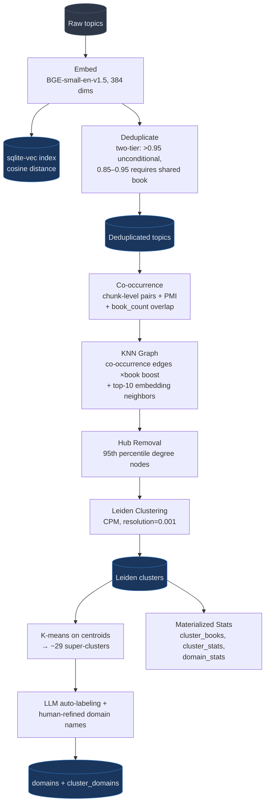

# Graph & Clustering Pipeline

The Graph & Clustering Pipeline transforms raw extracted topics into a clustered, searchable topic graph. It runs after the [Topic Extraction Pipeline](./topic-extraction-pipeline.md) and produces the Leiden clusters and domains that power the web interface.

## Pipeline Overview



## Stages

### 1. Embedding Generation

**Module**: `src/libtrails/embeddings.py`

Generates 384-dimensional embeddings for all topic labels using **BGE-small-en-v1.5** (BAAI). Embeddings are stored as binary blobs in `topics.embedding` and indexed in the `topic_vectors` sqlite-vec virtual table for cosine search.

- Model cached locally in `models/BAAI_bge-small-en-v1.5/` (~130MB)
- Batch processing for efficiency
- `--force` flag regenerates all embeddings (needed after model change)

### 2. Two-Tier Deduplication

**Module**: `src/libtrails/deduplication.py`

Merges near-duplicate topics using a Union-Find data structure with two confidence tiers to prevent cross-domain conflation:

| Cosine Similarity | Action |
|-------------------|--------|
| > 0.95 | Merge unconditionally — obvious duplicates (e.g., "quantum mechanics" / "quantum mechanic") |
| 0.85 – 0.95 | Merge only if both topics share at least one book — prevents "energy manipulation" (fantasy) from merging with "psychological manipulation" (psychology) |
| < 0.85 | No merge |

**Implementation**:
- Loads all embeddings into memory, normalizes for cosine similarity
- Computes batch similarity (dot product on normalized vectors) in chunks of 5000
- Precomputes `topic_id → set(book_ids)` mapping for fast book-overlap checks
- Canonical topic = most frequently occurring label in each group
- All `chunk_topic_links` updated to point to canonical topics

**Configuration**:
- `DEDUP_SIMILARITY_THRESHOLD = 0.85`
- `DEDUP_HIGH_CONFIDENCE_THRESHOLD = 0.95`

### 3. Co-occurrence Computation

**Module**: `src/libtrails/topic_graph.py` → `compute_cooccurrences()`

Computes Pointwise Mutual Information (PMI) for all topic pairs that appear in the same chunk, plus a book-level overlap count.

**PMI formula**:
```
PMI(t1, t2) = log(P(t1,t2) / (P(t1) × P(t2)))
```

Where probabilities are estimated from chunk-level frequencies:
- `P(t1)` = chunks containing t1 / total chunks
- `P(t1,t2)` = chunks containing both / total chunks

**Book count**: For each co-occurring pair, also counts how many distinct books both topics appear in. This is stored in `topic_cooccurrences.book_count` and used to boost graph edge weights (see Stage 4).

A PMI of 0 means "co-occurs at chance level" — the `PMI_MIN_THRESHOLD = 1.0` filter keeps only genuinely surprising co-occurrences.

### 4. KNN Graph Construction

**Module**: `src/libtrails/topic_graph.py` → `build_topic_graph_knn()`

Builds an igraph `Graph` with two types of weighted edges:

**Co-occurrence edges**:
- From `topic_cooccurrences` where `count ≥ 2` and `PMI ≥ 1.0`
- Weight = `PMI × (1 + log(1 + book_count))`
- The book boost ensures topics sharing multiple books cluster more tightly than single-chunk overlaps
- Example: pair in 5 books gets 2.8× the weight of a pair in 0 books

**KNN embedding edges**:
- For each topic, finds its 10 nearest neighbors by cosine similarity (via scikit-learn `NearestNeighbors`)
- Only keeps edges with cosine similarity ≥ 0.65 (`KNN_MIN_SIMILARITY`)
- Prevents connecting unrelated topics that happen to be neighbors in sparse embedding regions

Edge deduplication ensures no duplicate edges between the same pair.

**Configuration**:
- `CLUSTER_KNN_K = 10`
- `KNN_MIN_SIMILARITY = 0.65`
- `COOCCURRENCE_MIN_COUNT = 2`
- `PMI_MIN_THRESHOLD = 1.0`

### 5. Hub Removal

High-degree "hub" topics (95th percentile by degree) are removed before clustering. These are generic topics that connect many unrelated communities and would create artificially large, incoherent clusters.

Hub topics are recorded in `topic_cluster_memberships` with strength scores for their multiple cluster affinities.

### 6. Leiden Clustering

**Module**: `src/libtrails/clustering.py`

Runs the Leiden community detection algorithm on the graph.

```python
import leidenalg
partition = leidenalg.find_partition(
    graph,
    leidenalg.CPMVertexPartition,
    resolution_parameter=0.001,
    weights="weight",
)
```

- **CPM** (Constant Potts Model) produces more even-sized clusters than modularity
- Resolution parameter 0.001 optimized for ~300-400 coherent clusters
- Each topic gets a `cluster_id` in the `topics` table

**Configuration**:
- `CLUSTER_PARTITION_TYPE = "cpm"`
- `CLUSTER_RESOLUTION = 0.001`

### 7. Domain Generation (Super-Clusters)

**Module**: `src/libtrails/domains.py`

Groups ~1,200+ Leiden clusters into ~29 high-level domains using K-means on cluster centroids.

1. Compute robust centroid per cluster (weighted average of top-15 topic embeddings)
2. Run K-means to group centroids into ~29 super-clusters
3. Auto-generate labels with LLM based on constituent topic labels
4. Human refinement of domain names (stored in `experiments/domain_labels_final.py`)
5. Load into `domains` and `cluster_domains` tables

**Workflow**:
```bash
uv run libtrails regenerate-domains      # K-means + auto-labels
# Edit experiments/domain_labels_final.py with refined names
uv run python experiments/domain_labels_final.py  # Generate JSON
uv run libtrails load-domains            # Load into DB
```

### 8. Materialized Stats

**Module**: `src/libtrails/stats.py`

Three denormalized tables for fast API responses:

| Table | Contents |
|-------|----------|
| `cluster_books` | Books per cluster with topic counts |
| `cluster_stats` | Cluster sizes, book counts, top topics |
| `domain_stats` | Domain sizes, cluster counts, book counts |

Automatically refreshed after `cluster`, `load-domains`, and `process` commands.

## CLI Commands

```bash
# Run full pipeline (embed → dedupe → cluster → stats)
uv run libtrails process

# Individual stages
uv run libtrails embed                   # Generate embeddings
uv run libtrails embed --force           # Regenerate all
uv run libtrails dedupe --dry-run        # Preview deduplication
uv run libtrails dedupe                  # Run deduplication
uv run libtrails cluster                 # Leiden clustering

# Domain management
uv run libtrails regenerate-domains      # Generate super-clusters
uv run libtrails load-domains            # Load refined domain labels

# Stats
uv run libtrails refresh-stats           # Rebuild materialized tables
```

## Configuration Reference

| Setting | Default | Description |
|---------|---------|-------------|
| `DEDUP_SIMILARITY_THRESHOLD` | `0.85` | Lower dedup threshold (requires book overlap) |
| `DEDUP_HIGH_CONFIDENCE_THRESHOLD` | `0.95` | Upper threshold (unconditional merge) |
| `KNN_MIN_SIMILARITY` | `0.65` | Minimum cosine similarity for KNN graph edges |
| `COOCCURRENCE_MIN_COUNT` | `2` | Minimum chunk co-occurrences for graph edges |
| `PMI_MIN_THRESHOLD` | `1.0` | Minimum PMI for co-occurrence edges |
| `CLUSTER_KNN_K` | `10` | Number of nearest neighbors per topic |
| `CLUSTER_PARTITION_TYPE` | `cpm` | Leiden partition type |
| `CLUSTER_RESOLUTION` | `0.001` | CPM resolution parameter |

## Database Tables

| Table | Created by | Description |
|-------|-----------|-------------|
| `topics` | Embedding + Dedup + Cluster | Normalized topics with embeddings and cluster assignments |
| `topic_vectors` | Embedding | sqlite-vec virtual table for cosine search |
| `topic_cooccurrences` | Co-occurrence | Chunk co-occurrence counts, PMI, and book overlap |
| `topic_cluster_memberships` | Clustering | Hub topic multi-cluster membership |
| `domains` | Domain generation | Super-cluster labels |
| `cluster_domains` | Domain generation | Cluster → domain mapping |
| `cluster_books` | Stats refresh | Materialized book-cluster associations |
| `cluster_stats` | Stats refresh | Materialized cluster statistics |
| `domain_stats` | Stats refresh | Materialized domain statistics |
