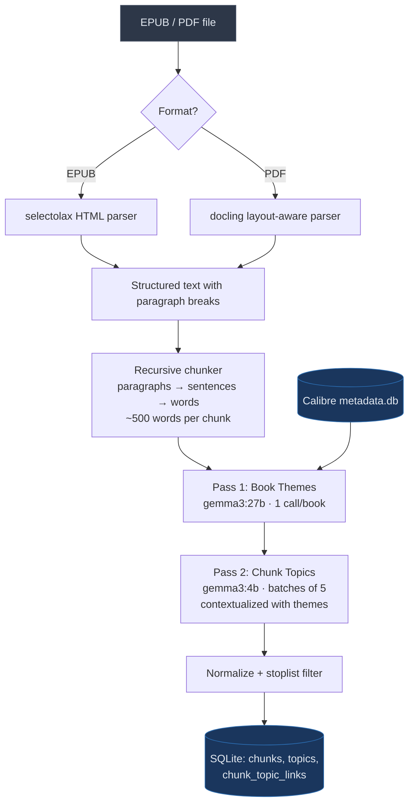

# Topic Extraction Pipeline

The Topic Extraction Pipeline converts raw EPUB/PDF files into chunked text with extracted topics. It runs per-book and uses a two-pass LLM strategy to produce high-quality, domain-specific topic labels.

## Pipeline Overview



## Stages

### 1. Document Parsing

**Module**: `src/libtrails/document_parser.py`

Extracts plain text from EPUB and PDF files, preserving paragraph structure.

**EPUB** (primary format):
- Uses `selectolax` for fast HTML parsing
- Reads all XHTML/HTML content files in sorted order
- Strips non-content elements (`<script>`, `<style>`, `<nav>`, `<header>`, `<footer>`)
- Converts block-level HTML tags (`<p>`, `<div>`, `<h1>`–`<h6>`, `<li>`, `<blockquote>`, etc.) to paragraph breaks (`\n\n`)
- Strips remaining inline tags, decodes HTML entities (`&amp;`, `&rsquo;`, `&mdash;`, etc.)
- Removes EPUB artifacts (footnote markers like `[1]`)
- Skips TOC, NCX, and OPF files
- Handles Calibre's `.html_split_NNN` format and XHTML self-closing tags

**PDF** (fallback):
- Uses `docling` for layout-aware extraction
- Exports to markdown, then cleans for chunking

### 2. Text Chunking

**Module**: `src/libtrails/chunker.py`

Splits text into ~500-word chunks using a recursive splitting hierarchy that preserves natural boundaries:

1. **Paragraphs** (preferred) — split on `\n\n`, keeps complete thoughts together
2. **Sentences** (fallback) — split at `.`, `!`, `?` boundaries for long paragraphs
3. **Words** (last resort) — split on spaces for very long sentences

**Sentence splitting** handles edge cases:
- Abbreviations: Mr., Mrs., Dr., Prof., St., Jr., etc. (33 entries)
- Multi-period abbreviations: U.S., Ph.D., D.C., M.I.T.
- Initials: J. K. Rowling
- Decimals: 3.5 million (only if next word is lowercase)
- Lowercase continuation: rejoins false splits where the next word starts lowercase

**Configuration** (`config.py`):
- `CHUNK_TARGET_WORDS = 500` — target words per chunk
- `CHUNK_MIN_WORDS = 100` — chunks below this are discarded

### 3. Pass 1: Book Theme Extraction

**Function**: `extract_book_themes()` in `src/libtrails/topic_extractor.py`

One call to **gemma3:27b** per book. Produces 5–8 high-level themes that anchor the per-chunk extraction in Pass 2.

**Inputs**:
- Book title and author
- Calibre tags (cleaned: noise tags removed, compound variants normalized, capped at 10)
- Calibre description (HTML stripped, truncated to 500 chars)
- Series name (if applicable)
- First ~1000 words of book text

**Prompt strategy**:
- Instructs for specific multi-word noun phrases (e.g., "epic fantasy worldbuilding", "algorithmic trading strategies")
- Explicitly prohibits generic single words ("conflict", "power", "love")
- Requests genre/domain as the first theme

**Output**: JSON array via Ollama structured output (`format` parameter with JSON schema). Themes are stored as a JSON array in `books.book_themes`.

**Metadata cleanup** (applied before prompting):
- `strip_html()` — removes HTML tags and collapses whitespace from Calibre descriptions
- `clean_calibre_tags()` — removes noise tags ("General", "Fiction", "Unknown"), normalizes compound variants ("Fiction - Science Fiction" → "Science Fiction"), removes substring duplicates

### 4. Pass 2: Batched Chunk Topic Extraction

**Function**: `extract_topics_batched()` in `src/libtrails/topic_extractor.py`

Groups consecutive chunks into batches of 5 and calls **gemma3:4b** once per batch. Each call is contextualized with the book's title, author, and themes from Pass 1.

**Prompt structure**:
```
Book: {title} by {author}
Book themes: {theme1}, {theme2}, ...

Extract 5 specific topic labels from EACH passage below.
Topics should be multi-word noun phrases specific to the content.

--- Passage 1 ---
{chunk text}

--- Passage 2 ---
{chunk text}
...

Return a JSON object mapping passage numbers to topic arrays.
```

**Output**: Structured JSON via Ollama `format` parameter:
```json
{"1": ["topic a", "topic b", ...], "2": [...], ...}
```

**Fallback**: If batch JSON parsing fails, retries each chunk individually with `_extract_single_contextualized()`.

### 5. Topic Normalization and Filtering

**Function**: `normalize_topic()` in `src/libtrails/topic_extractor.py`

Applied to every extracted topic before storage:

1. **Normalize**: lowercase, strip whitespace, replace underscores with spaces, collapse multiple spaces
2. **Stoplist filter**: Returns `None` for 30 generic single-word topics that pollute clustering:
   ```
   manipulation, relationships, technology, society, nature, life, death,
   love, power, time, people, world, change, future, communication,
   conflict, loss, survival, identity, freedom, control, trust, fear,
   growth, knowledge, science, culture, politics, art, history
   ```

## CLI Commands

```bash
# Index a single book (two-pass extraction)
uv run libtrails index --title "Siddhartha"

# Index by database ID
uv run libtrails index 42

# Index all books
uv run libtrails index --all

# Parse and chunk only (skip LLM extraction)
uv run libtrails index --title "Dune" --dry-run

# Use legacy single-call extraction (no themes, no batching)
uv run libtrails index --title "Dune" --legacy

# Override models
uv run libtrails index --all --theme-model gemma3:27b --chunk-model gemma3:4b

# Override batch size
uv run libtrails index --all --batch-size 10

# Index specific books by ID
uv run libtrails index --id 42 --id 100 --id 205
```

## Configuration Reference

| Setting | Default | Description |
|---------|---------|-------------|
| `THEME_MODEL` | `gemma3:27b` | Model for book-level theme extraction |
| `CHUNK_MODEL` | `gemma3:4b` | Model for chunk-level topic extraction |
| `BATCH_SIZE` | `5` | Chunks per batch in Pass 2 |
| `TOPICS_PER_CHUNK` | `5` | Topics extracted per chunk |
| `CHUNK_TARGET_WORDS` | `500` | Target words per chunk |
| `CHUNK_MIN_WORDS` | `100` | Minimum words to keep a chunk |
| `OLLAMA_NUM_CTX` | `8192` | Ollama context window size |
| `TOPIC_STOPLIST` | 30 words | Generic single-word topics filtered out |

## Performance

| Stage | Time per unit | Full library (927 books) |
|-------|--------------|--------------------------|
| EPUB parsing | ~1s/book | ~15 min |
| Chunking | <0.1s/book | negligible |
| Pass 1 (27b themes) | ~10s/book | ~2.5 hours |
| Pass 2 (4b batched) | ~2s/chunk | ~40 hours |
| **Total** | | **~43 hours** |

Timing measured on Apple Silicon with Ollama running locally. Pass 2 dominates — chunk count depends on book length (avg ~83 chunks/book at 500 words).
